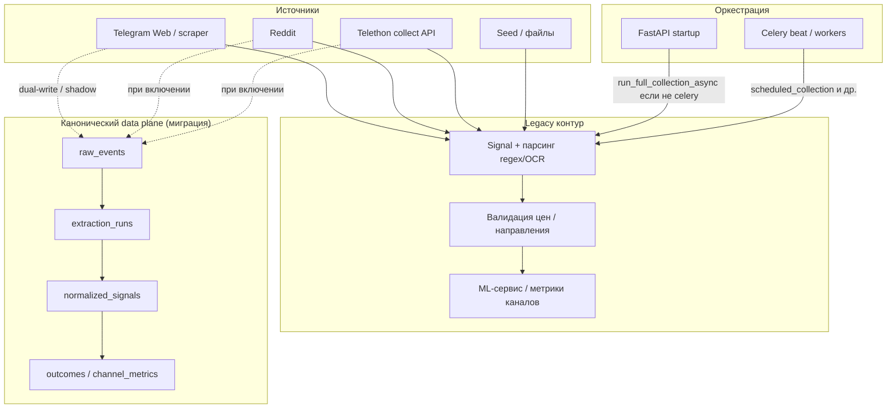

# Пайплайн сбора и распознавания сигналов (текущее состояние)

**Назначение:** единая картина **legacy** и **канонического** контура для диагностики и приёмки.  
**Связано:** `docs/DATA_PLANE_MIGRATION.md`, `backend/app/main.py`, `backend/app/services/collection_pipeline.py`, `backend/app/services/telegram_collector.py`, `docs/ADR_RT_TELETHON_LLM_EVALUATION.md`.

## Кратко

- **Legacy:** источники (Telegram web / Reddit / Telethon collect API / seed) → `Signal` → парсинг (regex/OCR) → валидация → ML/метрики.
- **Канонический (в миграции):** те же или расширенные источники → `raw_events` → `extraction_runs` → `normalized_signals` → `outcomes` / `channel_metrics` (см. `DATA_PLANE_MIGRATION.md`).
- **Оркестрация:** при старте API — `run_full_collection_async` (если не `SCHEDULER_MODE=celery`); иначе периодические задачи через Celery beat (`scheduled_collection`, `scheduled_ml_training`, и т.д.).

## Диаграмма (высокий уровень)

## Пошаговое описание

### 1. Сбор (ingestion)

| Путь | Механизм | Куда попадает |
|------|-----------|----------------|
| Telegram (web) | Scraper / парсер HTML | Legacy: создание/обновление `Signal`; при dual-write — также `raw_events` (если включено). |
| Reddit | Клиент Reddit | Аналогично. |
| Telethon | `telegram_collector` (collect), не real-time listener в MVP | Сообщения → обработка → сигналы / raw по конфигурации. |
| Seed | Файлы/фикстуры | Тесты и ручной backfill. |

### 2. Распознавание (parsing / extraction)

- **Legacy:** шаблонный парсер + OCR fallback, валидация, дедуп по правилам продукта.
- **Канонический:** `extraction_runs` с версией экстрактора, `normalized_signals` как нормализованный выход.

### 3. Ниже по пайплайну

- ML, Stripe, фронт — потребители уже распознанных и валидированных данных; критично не смешивать «сырой» и «нормализованный» слой в метриках без явного флага источника.

### 4. Schedulers

- **`SCHEDULER_MODE=celery`:** периодический сбор и ML — через Celery; стартовый полный сбор в `main.py` отключён для избежания дублирования.
- **Иначе:** при старте приложения вызывается `run_full_collection_async` (фоновая задача).

## Где «ломается» чаще всего (для диагностики)

1. Потери или дубликаты на границе источник → запись (нет идемпотентного ключа или race).
2. OCR / regex на нестандартных форматах → `uncertain` или мусор в метриках.
3. Расхождение legacy `Signal` и канонических таблиц до завершения миграции.

### Шаг 1 диагноза: метрики на неделю (минимум)

Зафиксировать и снимать еженедельно (пример набора — уточнить под прод):

| Метрика | Смысл |
|---------|--------|
| Сообщений принято / период | Объём входа по источникам. |
| Доля успешно распознанных (legacy или extractor) | Качество парсинга. |
| Доля «мусора» / `uncertain` / ошибок валидации | Шум и границы доверия. |

Детализация по OCR vs regex vs asset/price — по логам и тестам на проблемных форматах.

## Рекомендуемый порядок (согласовано с ADR по LLM)

1. Зафиксировать единый путь данных и метрики качества (см. `TZ_APPENDIX_DATA_PLANE_ACCEPTANCE.md`).
2. Укрепить детерминированный слой и золотой корпус сообщений.
3. Офлайн-пилот LLM: `docs/OFFLINE_LLM_PILOT_PLAN.md`.
4. Только после стабилизации — рассматривать real-time listener как опциональное обогащение.
