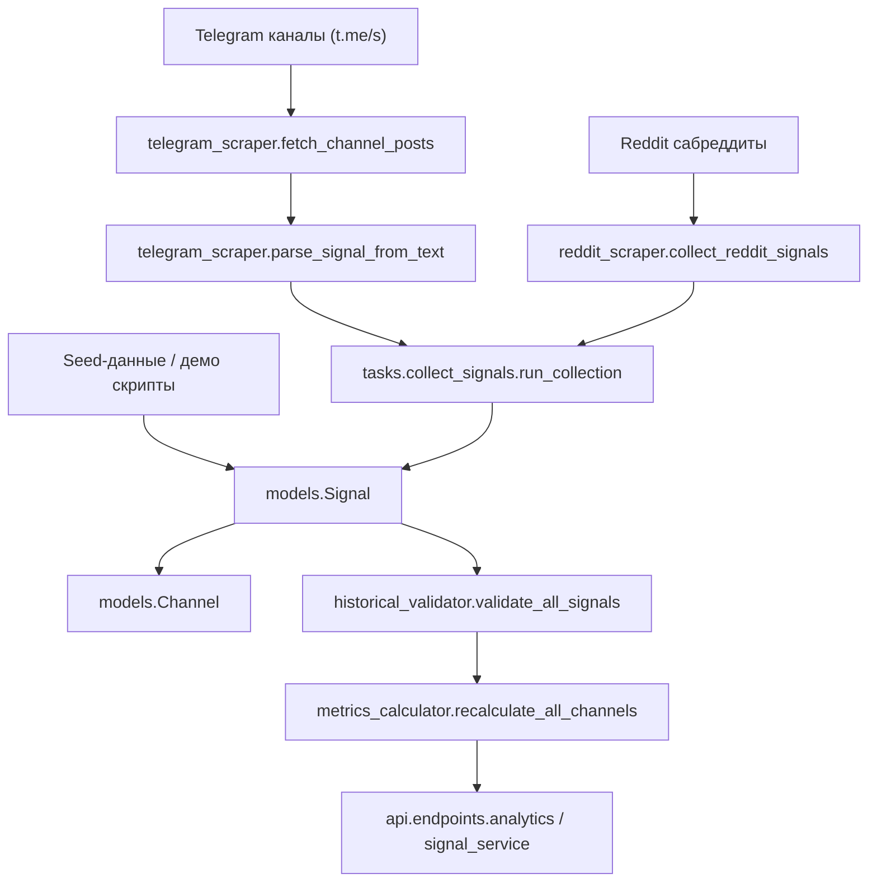

## Пайплайн сигналов: от источников до метрик

**Репозиторий:** `crypto-analytics-platform`  
**Цель документа:** зафиксировать один понятный путь данных для торговых сигналов, чтобы его можно было стабилизировать и улучшать.

---

### 1. Общая схема

---

### 2. Сбор данных

#### 2.1 Telegram (основной автоматический источник)

- **Скрапер и парсер (без API, по `t.me/s`):**  
  - Файл: `backend/app/services/telegram_scraper.py`
  - Ключевые сущности:
    - `ChannelPost` — дата‑класс для HTML‑поста канала.
    - `ParsedSignal` — результат парсинга одного сообщения (asset, direction, entry_price, take_profit, stop_loss, confidence, original_text, timestamp).
  - Основные функции:
    - `fetch_channel_posts(username: str, limit: int = 20) -> List[ChannelPost]`  
      Забирает HTML `https://t.me/s/{username}`, парсит последние сообщения через `BeautifulSoup`, извлекает текст, дату и просмотры.
    - `parse_signal_from_text(text: str) -> Optional[ParsedSignal]`  
      - Отбрасывает новости/дайджесты: `_is_news_or_digest`.
      - Отбрасывает мусор/спам: `_is_garbage`.
      - Ищет крипто‑актив: `_detect_asset`.
      - Парсит direction (`LONG`/`SHORT`) по ключевым словам/эмодзи.
      - Извлекает entry/TP/SL по шаблонам, валидирует цены (`_validate_price`, `_price_in_million_context`).
      - Возвращает `ParsedSignal` или `None`.
    - `collect_signals_from_channel(username: str) -> List[ParsedSignal]`  
      Асинхронно вызывает `fetch_channel_posts`, дальше — `parse_signal_from_text` для каждого поста, возвращает список всех успешных `ParsedSignal`.

- **Планировщик / батч‑таск:**  
  - Файл: `backend/app/tasks/collect_signals.py`
  - Функция `run_collection()`:
    - Берёт из БД все активные каналы:  
      `Channel.is_active == True`, `Channel.platform == "telegram"`.
    - Для каждого канала вызывает `collect_signals_from_channel(username)` (через event loop).
    - Для всех `ParsedSignal`:
      - Проверяет наличие `entry_price`.
      - Выполняет дедупликацию (см. раздел 3).
      - Создаёт новые записи `Signal` и увеличивает `channel.signals_count`.
    - После прохода по всем каналам:
      - Коммитит транзакцию.
      - Вызывает `metrics_calculator.recalculate_all_channels(db)`.

#### 2.2 Reddit

- **Простой скрапер (RSS + общий парсер):**  
  - Файл: `backend/app/services/reddit_scraper.py`
  - Функции:
    - `fetch_subreddit_posts(subreddit)` — читает RSS, парсит посты.
    - `collect_reddit_signals(subreddit)` — использует `telegram_scraper.parse_signal_from_text` для выявления сигналов в тексте.
    - `collect_all_reddit_signals()` — агрегирует по списку сабреддитов.
  - **Статус:** сейчас выдаёт `ParsedSignal`, но напрямую в основной `Signal`/БД не пишет — используется как вспомогательный источник.

- **Новый модульный Reddit‑парсер (через API):**  
  - Файл: `backend/app/parsers/reddit_parser.py` (+ `base_parser.py`)  
  - Даёт более богатую структуру (`ParsedSignal` с `additional_data`), но ещё не интегрирован в основной `run_collection()`.

#### 2.3 Seed / демо‑данные

- **Скрипт для заполнения БД:**  
  - Файл: `backend/scripts/seed_data.py`
  - Создаёт пользователей, каналы, сигналы, метрики для демо‑окружения.
  - **Замечание:** скрипт частично отстаёт от актуальных моделей (`Signal` уже другая) и требует синхронизации.

---

### 3. Запись сигналов и дедупликация

- **Основная модель сигналов:**  
  - Файл: `backend/app/models/signal.py`
  - Класс `Signal` (таблица `signals`) содержит:
    - Идентификаторы и связи: `id`, `channel_id`, `channel`, `result`, `positions`.
    - Структура сигнала: `asset`, `symbol`, `direction`, `entry_price`, `tp1_price/tp2_price/tp3_price`, `stop_loss`, `entry_price_low/high`, `original_text`, `message_timestamp`, `telegram_message_id`.
    - Статус: `status`, `entry_hit_at`, `tp*_hit_at`, `sl_hit_at`, `final_exit_price`, `final_exit_timestamp`, `expires_at`, `cancelled_at`, `cancellation_reason`.
    - Аналитика: `profit_loss_percentage`, `profit_loss_absolute`, флаги `is_successful`, `reached_tp*`, `hit_stop_loss`, ML‑поля.

- **Создание сигналов из парсера (в `run_collection()`):**
  - На входе — список `ParsedSignal` для канала.
  - Для каждого:
    - Если `entry_price` отсутствует → сигнал пропускается (не пишется в БД).
    - Дедупликация:
      - Берётся первые 500 символов `sig.original_text` → `text_500`.
      - Через `func.left(Signal.original_text, 500)` ищется существующий `Signal` с тем же `channel_id` и `text_500`.
      - Если найден → новый сигнал не создаётся.
    - Если не дубликат:
      - Создаётся `Signal` с полями `channel_id`, `asset`, `symbol` (asset без `/`), `direction`, `entry_price`, `tp1_price`, `stop_loss`, `confidence_score`, `original_text`, `status="PENDING"`.
      - Инкрементируется `channel.signals_count`.

- **Отдельная упрощённая модель `TelegramSignal`:**
  - В том же файле определена таблица `telegram_signals` для более лёгкой интеграции с ботом.
  - Основной аналитический пайплайн (валидация, метрики) завязан на `Signal`, а не на `TelegramSignal`.

---

### 4. Валидация сигналов и метрики

#### 4.1 Историческая валидация по рынку

- Файл: `backend/app/services/historical_validator.py`
  - `get_price_range_after(asset, after_date, days)` — тянет данные из CoinGecko (OHLC/market_chart) и считает high/low/close в заданном окне.
  - `validate_signal_historically(...)` — для одного `Signal`:
    - Нормализует TP/SL с учётом `direction`.
    - Проверяет, были ли достигнуты уровни.
    - Считает PnL в процентах и возвращает исход (`TP_HIT`, `SL_HIT`, `OPEN`, `NO_DATA`).
  - `validate_all_signals(db)`:
    - Итерируется по всем сигналам, валидирует каждый, обновляет поля `status`, `profit_loss_percentage`, `profit_loss_absolute`, флаги успеха.
    - После завершения вызывает `metrics_calculator.recalculate_all_channels(db)`.

#### 4.2 Метрики каналов и рейтинг

- Файл: `backend/app/services/metrics_calculator.py`
  - `recalculate_channel_metrics(db, channel_id)`:
    - Считает по всем сигналам канала:
      - `signals_count`, `successful_signals`, `accuracy` (win‑rate).
      - `average_roi` как среднее по `profit_loss_*` (см. замечания ниже).
    - Обновляет поля в `Channel`.
  - `recalculate_all_channels(db)` — запускает расчёт для всех каналов.

- Файл: `backend/app/models/channel.py`
  - Хранит агрегированные метрики: `accuracy`, `signals_count`, `successful_signals`, `average_roi` и др.

- Файл: `backend/app/models/performance_metric.py`
  - Таблица `performance_metrics` — предрасчитанные метрики по окнам (daily/weekly/monthly/all_time) с win‑rate, ROI, drawdown, Sharpe и т.п.

- **API‑уровень:**
  - Файл: `backend/app/api/endpoints/analytics.py`
    - Эндпойнты для получения метрик по каналам, глобального рейтинга, price‑tracking, валидации сигналов по тексту.
  - Файл: `backend/app/services/signal_service.py`
    - Методы `get_signal_stats`, `get_channel_stats`, `get_asset_performance`, `get_top_performing_signals`.

---

### 5. Слабые места текущего пайплайна (важно для последующих задач)

1. **Разрыв между Telegram/Reddit‑ветками:**
   - Старый `reddit_scraper` и новый `parsers/reddit_parser.py` не интегрированы в единый поток → разные критерии парсинга и confidence.

2. **Несогласованность ROI/PNL:**
   - `historical_validator` пишет проценты и в `profit_loss_percentage`, и в `profit_loss_absolute`, а `metrics_calculator` считает `average_roi` по «absolute» полю.  
   → Требуется выровнять семантику этих полей.

3. **Seed‑скрипт vs актуальная модель `Signal`:**
   - `scripts/seed_data.py` использует поля, которых уже нет или они переименованы, поэтому его нельзя считать надёжным источником демо‑данных.

4. **Дедупликация по первым 500 символам:**
   - Простая, но грубая схема: небольшие изменения текста → лишние сигналы; длинные шаблонные тексты с разными ценами → риск ложных дубликатов.

5. **Неполная интеграция `SignalResult` и ML‑слоя:**
   - `models/signal_result.py` помечен как заглушка; фактический ML/feedback‑пайплайн до конца не реализован.

6. **Analytics API завязан на опциональные сервисы:**
   - В `analytics.py` сервисы импортируются в `try/except ImportError` и при проблемах становятся `None`, но это не всегда явно отражается в ответах API.

---

Этот документ — опорная точка для задач `dp-1`–`dp-5`: стабилизации сбора, распознавания, хранения и метрик перед любыми real-time/LLM надстройками.

